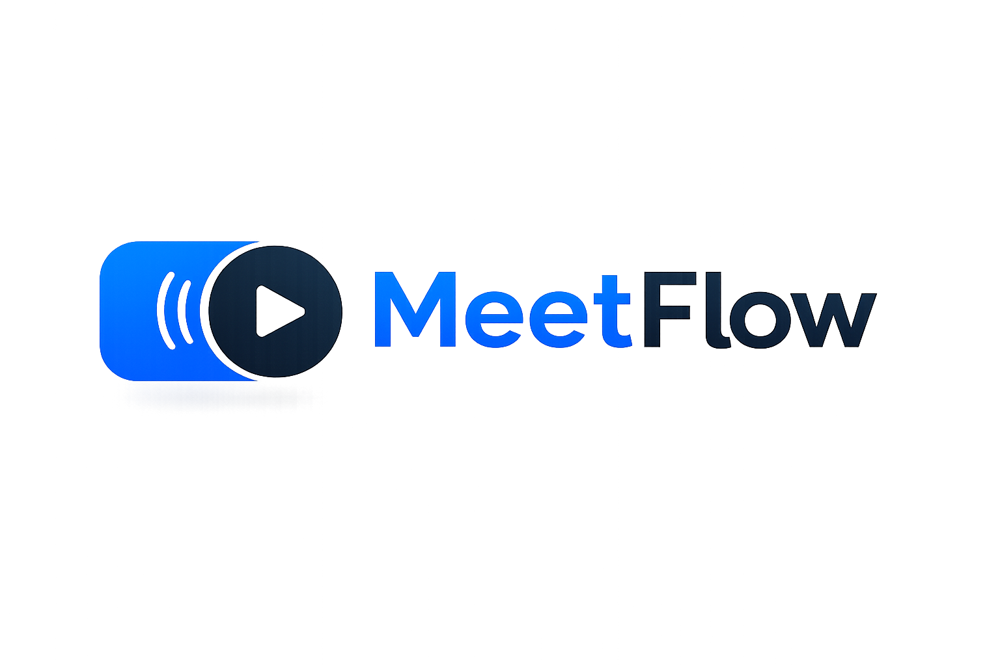
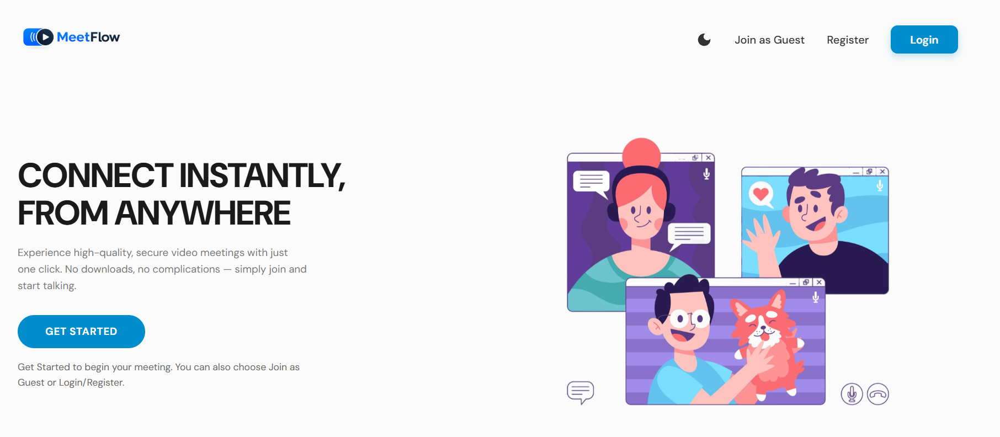
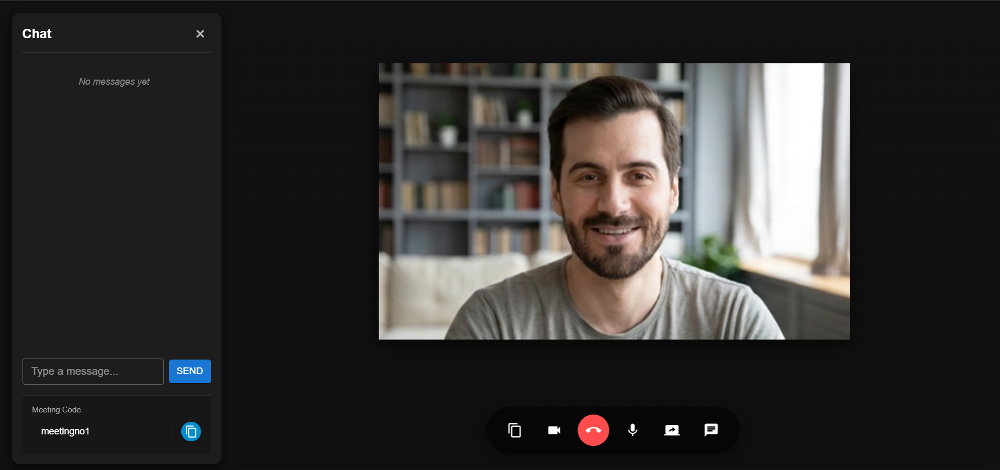

<div align="center">



<h1>MeetFlow – Video Conferencing Application</h1>

<p><em>Connect • Collaborate • Communicate</em></p>

<p>
  
  
  
  
  
  
  
</p>

</div>

---

# Overview

MeetFlow is a modern **real-time video conferencing application** that enables seamless communication through high-quality video calls, screen sharing, and instant messaging.

Built using **React, Node.js, WebRTC, and Socket.io**, MeetFlow provides a simple interface for hosting and joining meetings with minimal setup.

---

# Live Demo

> 🚀 **[Try MeetFlow Live →](https://github.com/Mehak-991/MeetFlow)**

---

# Features

| Feature | Description |
|------|-------------|
| 🎥 Video Calls | Real-time video and audio communication |
| 💬 Real-Time Chat | Send messages during meetings |
| 🖥️ Screen Sharing | Share screen with participants |
| 👥 Multi-Participant Meetings | Support for multiple users |
| 🔐 Secure Authentication | Login and registration system |
| 🌗 Dark / Light Mode | UI theme toggle |
| 🔑 Meeting Code Join | Join meeting via code |
| 📱 Responsive Design | Works across devices |
| ⚡ Real-Time Signaling | WebRTC signaling via Socket.io |

---

# Tech Stack

---

## Frontend

[](https://skillicons.dev)

| Technology | Purpose |
|-----------|---------|
| React | Frontend UI framework |
| Material UI | UI component library |
| React Router | Client-side routing |
| Socket.io Client | Real-time communication |
| WebRTC | Peer-to-peer video/audio streaming |

---

## Backend

[](https://skillicons.dev)

| Technology | Purpose |
|-----------|---------|
| Node.js | Runtime environment |
| Express.js | Backend framework |
| Socket.io | WebSocket communication |
| MongoDB | NoSQL database |
| JWT | Authentication tokens |
| bcrypt | Password hashing |

---

## Project Structure

.png)


# Installation

## Prerequisites

- Node.js (v14 or higher)
- MongoDB (local or MongoDB Atlas)
- npm or yarn

---

# Backend Setup

### Navigate to backend

```
cd backend
```

### Install dependencies

``` 
npm install
```
### Create environment file

```
cp .env.example .env
```

### Configure environment variables

```
MONGODB_URI=your_mongodb_uri
JWT_SECRET=your_secret_key
PORT=8000
NODE_ENV=development
FRONTEND_URL=http://localhost:3000
```

### Start backend server

```
npm start
```

Server runs on

```
http://localhost:8000
```


---

# Frontend Setup

### Navigate to frontend

```
cd frontend
```

### Install dependencies

```
npm install
```

### Create environment file

```
cp .env.example .env
```

### Configure environment

```
REACT_APP_API_URL=http://localhost:8000
REACT_APP_SOCKET_URL=http://localhost:8000
```

### Start frontend

```
npm start
```

Frontend runs on

```
http://localhost:3000
```

---

# Application Workflow

---

## Landing Page



Users can

- Create an account
- Login to account
- Join meeting as guest

---

## Authentication


Users can

- Register new account
- Login using credentials

Passwords are securely hashed using **bcrypt**.

---

## Meeting Dashboard


Users can

- Create meeting
- Join meeting using meeting code

---

## Meeting Lobby


Before joining users can

- Preview camera
- Enable microphone
- Enter display name

---

## Video Meeting Interface



Meeting interface includes

- Video grid
- Chat panel
- Meeting controls
- Participant display

---

## Meeting Controls


Controls available

- Camera toggle
- Microphone mute/unmute
- Screen sharing
- Chat panel
- Copy meeting code
- Leave meeting

---

# Deployment

## Backend Deployment (Render / Railway)

> ✅ **Recommended:** Use [Render](https://render.com) or [Railway](https://railway.app) — both free tiers available in 2025.

### Deploy on Render

1. Push code to GitHub
2. Go to [render.com](https://render.com) → New Web Service
3. Connect your GitHub repo
4. Set Build Command: `npm install`
5. Set Start Command: `node src/app.js`
6. Add environment variables in dashboard

### Deploy on Railway

```
npm install -g @railway/cli
railway login
railway init
railway up
```

Set environment variables

```
railway variables set MONGODB_URI=your_uri
railway variables set JWT_SECRET=your_secret
```

---

## Frontend Deployment (Vercel / Netlify)

Build production

```
npm run build
```

Deploy using Vercel

```
vercel --prod
```

or Netlify

```
netlify deploy --prod
```

---

# Security Best Practices

Never commit `.env` files to Git.

Check

```
git status
```

If tracked remove

```
git rm --cached .env
git rm --cached backend/.env
git rm --cached frontend/.env
```

---

# Generate Secure JWT Secret

```
node -e "console.log(require('crypto').randomBytes(64).toString('hex'))"
```

---

# License

This project is licensed under the **MIT License**.

---

# Author

**Mehak Verma**

[](https://github.com/Mehak-991)

For support or issues, open a [GitHub Issue](https://github.com/Mehak-991/MeetFlow/issues).
